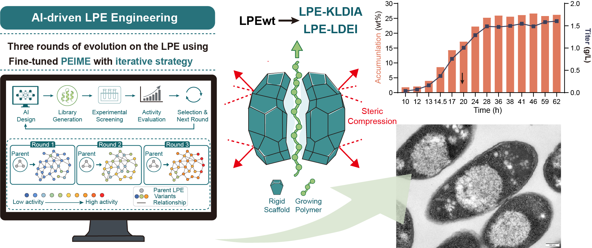

# PRIME-L: Protein Language Model-Guided LPE Design



PRIME-L is a standalone implementation for LPE1439 mutation design. It follows the
[VenusFSFP](https://github.com/ai4protein/VenusFSFP)-style few-shot fine-tuning
workflow and uses `AI4Protein/Prime_690M` as the default protein language model.

Supported tasks:

- single-site mutation prediction after alanine-scan fine-tuning
- multi-site combinatorial mutation prediction with a PRIME-L encoder and an MLP regression head

The code is kept independent from the original
[VenusFSFP](https://github.com/ai4protein/VenusFSFP) source tree. Generated data,
checkpoints, and prediction tables are written under this repository unless you
override the paths.

> [!IMPORTANT]
> **Required for custom or user-supplied datasets:** default hyperparameters are
> starting points only. Before running final single-site or multi-site prediction
> on any new protein or private fitness dataset, you must use cross-validation
> to select suitable values for LoRA rank, learning rate, training epochs, batch
> size, list size, masking mode, and early-stopping patience.

## Requirements

### Software

The code has been tested with the following package versions:

```text
python 3.12.3
pytorch 2.3.0+cu121
cuda 12.1
transformers 4.41.1
peft 0.4.0
learn2learn 0.2.1
pandas 2.2.2
openpyxl 3.1.5
scipy 1.13.1
scikit-learn 1.5.0
tqdm 4.66.4
numpy 1.26.4
```

### Hardware

Full PRIME-L fine-tuning and multi-site embedding are GPU workloads. CPU mode is
available for debugging through `--force-cpu`, but it is not recommended for full
prediction runs.

### Installation

From the repository root:

```bash
cd PRIME-L
python -m primel.cli --help
```

One possible conda/pip setup is:

```bash
conda create -n <env_name> python=3.12.3
conda activate <env_name>
pip install torch==2.3.0 --index-url https://download.pytorch.org/whl/cu121
pip install transformers==4.41.1 peft==0.4.0 learn2learn==0.2.1 \
  pandas==2.2.2 openpyxl==3.1.5 scipy==1.13.1 \
  scikit-learn==1.5.0 tqdm==4.66.4 numpy==1.26.4
```

The default model path is configured in `configs/default.json`:

```json
{
  "model": {
    "name": "AI4Protein/Prime_690M",
    "trust_remote_code": true,
    "local_files_only": true
  }
}
```

Set `local_files_only` to `false` if you want HuggingFace to download missing
model files.

## Config File

The config file `configs/default.json` defines the paths and model settings used
by all commands.

Important fields:

- `study_dir`: directory containing the LPE1439 Excel files.
- `protein_gym_pkl`: [VenusFSFP](https://github.com/ai4protein/VenusFSFP)-preprocessed ProteinGym pkl used for optional auxiliary meta-training.
- `gemme_data`: optional GEMME pseudo-fitness table for LPE1439 single-site substitutions.
- `lpe_data_pkl`: parsed LPE1439 pkl generated by `primel.cli prepare`.
- `model.name`: HuggingFace model id or local model directory.
- `model.trust_remote_code`: required for `AI4Protein/Prime_690M`.
- `model.local_files_only`: whether to use only local HuggingFace cache.
- `lora.r`: LoRA rank.
- `lora.alpha`: LoRA alpha.
- `lora.dropout`: LoRA dropout.
- `lora.target_modules`: module names patched by LoRA.

## Data Preparation

PRIME-L uses three data sources:

- LPE1439 experimental data for target fine-tuning and multi-site regression.
- [VenusFSFP](https://github.com/ai4protein/VenusFSFP)/ProteinGym data for optional auxiliary meta-training.
- GEMME pseudo-fitness data for the LPE1439 auxiliary meta-learning task.

### LPE1439 Experimental Data

Place the LPE1439 data directory so that it contains these files:

```text
This study_Ala scan.xlsx
This study_PLA_round1.xlsx
This study_PLA_round2.xlsx
This study_PLA_round3.xlsx
```

The default local path is `/home/pan/PhaC_datas/This_study`. You can change it in
`configs/default.json`.

Run:

```bash
python -m primel.cli prepare
```

This writes:

```text
data/lpe1439.pkl
data/summaries/ala_scan.csv
data/summaries/round1.csv
data/summaries/round2.csv
data/summaries/round3.csv
```

The generated pkl contains the wild-type sequence, alanine-scan records, and the
measured mutation datasets used by the single-site and multi-site workflows.


### VenusFSFP / ProteinGym Data Preparation

Auxiliary meta-training follows the
[VenusFSFP](https://github.com/ai4protein/VenusFSFP) data format. Each raw
substitution CSV should contain at least:

```text
mutant,mutated_sequence,DMS_score
```

`DMS_score_bin` is optional. If it is absent, PRIME-L creates binary labels from
the median score for metrics and top-k precision reporting.

If you already have the [VenusFSFP](https://github.com/ai4protein/VenusFSFP)
repository, put ProteinGym substitution CSVs under:

```text
VenusFSFP-main/data/substitutions/
```

Then run the original [VenusFSFP](https://github.com/ai4protein/VenusFSFP)
preprocessing:

```bash
cd /path/to/VenusFSFP-main
python preprocess.py -s
```

This creates:

```text
VenusFSFP-main/data/merged.pkl
```

For a standalone PRIME-L checkout, copy or symlink it into this repository:

```bash
cd /path/to/PRIME-L
mkdir -p data
cp /path/to/VenusFSFP-main/data/merged.pkl data/merged.pkl
```

Alternatively, set `protein_gym_pkl` in `configs/default.json` to the absolute
path of your [VenusFSFP](https://github.com/ai4protein/VenusFSFP) `merged.pkl`.

### GEMME Data Preparation

GEMME scores for all possible LPE1439 single-amino-acid substitutions are used
as an additional pseudo-labeled auxiliary task. PRIME-L accepts GEMME data
through `--gemme-data` or the `gemme_data` field in `configs/default.json`.

Long-table format:

```text
mutant,gemme_score
V38L,0.218
S186D,-0.104
```

Matrix format is also supported when the first column contains mutant amino acids
and the remaining columns are residue positions, for example:

```text
aa,1,2,3
A,,0.12,-0.42
C,-0.31,,
```

Rows with missing scores are ignored. Mutation labels are validated against the
LPE1439 wild-type sequence parsed from the LPE1439 workbook.

## Single-Site Mutation Prediction

Single-site prediction has two steps:

1. Fine-tune PRIME with alanine-scan data using [VenusFSFP](https://github.com/ai4protein/VenusFSFP)-style LoRA ranking training.
2. Score all possible single-amino-acid substitutions in LPE1439.

### Fine-Tune on Alanine Scan

Standard run:

```bash
python -m primel.cli finetune-ala \
  --epochs 50 \
  --train-batch 4 \
  --list-size 5 \
  --max-iter 10 \
  --output outputs/checkpoints/primel_ala
```

Run with optional [VenusFSFP](https://github.com/ai4protein/VenusFSFP) auxiliary meta-training:

```bash
python -m primel.cli finetune-ala \
  --meta-tasks 2 \
  --gemme-data data/gemme_lpe1439.csv \
  --meta-epochs 10 \
  --epochs 50 \
  --output outputs/checkpoints/primel_ala_meta
```

`--meta-tasks` retrieves similar ProteinGym tasks from the
[VenusFSFP](https://github.com/ai4protein/VenusFSFP).
`--gemme-data` adds the GEMME pseudo-fitness task for LPE1439 single mutants,
matching the recommended three-task auxiliary meta-learning setup.

### Predict Single-Site Mutations

```bash
python -m primel.cli predict-single \
  --checkpoint outputs/checkpoints/primel_ala \
  --output outputs/predictions/single_site_predictions.csv \
  --top-k 100
```

The output CSV is sorted by PRIME-L score and includes:

- `rank`
- `mutant`
- `wt_aas`
- `mt_aas`
- `positions`
- `mutated_sequence`
- `prediction`

### Parameters for `finetune-ala`

- `--config`: path to the JSON config file. Default: `configs/default.json`.
- `--data`: path to parsed LPE1439 pkl. Default: `lpe_data_pkl` from config.
- `--output`: checkpoint directory for the LoRA adapter and tokenizer files.
- `--epochs`: number of target alanine-scan fine-tuning epochs.
- `--meta-epochs`: number of auxiliary meta-training epochs when auxiliary tasks are used.
- `--train-batch`: outer batch size for ranking fine-tuning.
- `--eval-batch-size`: batch size used when scoring pseudo-task variants.
- `--embed-batch-size`: batch size for PRIME sequence embedding during auxiliary task retrieval.
- `--list-size`: number of variants per ListMLE ranking list.
- `--max-iter`: maximum number of ranking-list batches per epoch is `max_iter * train_batch`.
- `--learning-rate`: Adam/optimizer learning rate for LoRA updates.
- `--optimizer`: optimizer name. Supported values are `adam`, `sgd`, `nag`, `adagrad`, and `adadelta`.
- `--max-grad-norm`: gradient clipping threshold. Set to `0` to disable clipping.
- `--patience`: early-stop patience when validation is used by a trainer.
- `--mask`: mutational scoring context. `none` scores with the wild-type sequence; `train`, `eval`, or `all` use masked contexts for the corresponding phase.
- `--lora-r`: LoRA rank override. If omitted, `lora.r` from config is used.
- `--meta-tasks`: number of similar [VenusFSFP](https://github.com/ai4protein/VenusFSFP)/ProteinGym tasks to retrieve for auxiliary meta-training.
- `--gemme-data`: GEMME pseudo-fitness CSV, TSV, TXT, or Excel file for LPE1439 single-site substitutions. This is the recommended third auxiliary task.
- `--max-gemme-records`: optional maximum number of GEMME records retained. Omit this option to keep all parsed GEMME substitutions.
- `--pseudo-task-size`: optional fallback that creates a PRIME zero-shot pseudo task. The recommended setting should use `--gemme-data` instead.
- `--max-aux-records`: maximum records retained from each auxiliary task.
- `--meta-train-batch`: support-set batch size for MAML adaptation.
- `--meta-eval-batch`: query-set batch size for MAML meta-loss.
- `--adapt-lr`: inner-loop adaptation learning rate for MAML.
- `--adapt-steps`: number of inner-loop adaptation steps.
- `--seed`: random seed.
- `--force-cpu`: run on CPU even if CUDA is available.

### Parameters for `predict-single`

- `--config`: path to the JSON config file. Default: `configs/default.json`.
- `--data`: path to parsed LPE1439 pkl. Default: `lpe_data_pkl` from config.
- `--checkpoint`: LoRA adapter checkpoint directory from `finetune-ala`.
- `--output`: output CSV path.
- `--batch-size`: number of variants scored per batch.
- `--top-k`: also write a `*_topK.csv` file containing the top candidates.
- `--limit`: debug option that scores only the first N enumerated single mutants.
- `--mask`: scoring context. `none` uses wild-type context; `eval` or `all` uses masked context.
- `--force-cpu`: run on CPU even if CUDA is available.

## Multi-Site Mutation Prediction

Multi-site prediction performs full fine-tuning of the PRIME-L encoder together
with the MLP regression head, then ranks combinatorial mutation candidates.

During training, each mutant sequence is passed through the PRIME-L encoder to
produce an `L x 1280` hidden representation. Residue embeddings are mean-pooled
and passed to an MLP with dropout and `Tanh` output. MSE loss is backpropagated
through both the regression head and the PRIME-L encoder. The workflow uses
5-fold epoch selection and then performs final full-model training on all
available labeled variants.

Example using candidates generated from single-site predictions:

```bash
python -m primel.cli train-combo \
  --checkpoint outputs/checkpoints/primel_ala \
  --training-preset cumulative \
  --single-predictions outputs/predictions/single_site_predictions.csv \
  --seed-top-k 100 \
  --sites 2 5 \
  --top-k 40 \
  --run-name multi_site
```

Example using a custom candidate CSV:

```bash
python -m primel.cli train-combo \
  --checkpoint outputs/checkpoints/primel_ala \
  --training-preset cumulative \
  --candidates data/custom_multi_site_candidates.csv \
  --top-k 40 \
  --run-name custom_multi_site
```

The custom candidate CSV must contain a `mutant` column. Mutation labels can use
colon or slash separators, for example:

```text
mutant
V38L:S186D:L331I
V38L/S186D/L331I/S536A
```

Outputs are written to:

```text
outputs/checkpoints/combo/<run-name>/regression_head.pt
outputs/checkpoints/combo/<run-name>/regression_head.json
outputs/checkpoints/combo/<run-name>/encoder/encoder_full_state.pt
outputs/checkpoints/combo/<run-name>/combo_predictions.csv
outputs/checkpoints/combo/<run-name>/combo_predictions_topK.csv
```

### Parameters for `train-combo`

- `--config`: path to the JSON config file. Default: `configs/default.json`.
- `--data`: path to parsed LPE1439 pkl. Default: `lpe_data_pkl` from config.
- `--checkpoint`: PRIME-L LoRA adapter checkpoint from `finetune-ala`.
- `--training-preset`: labeled data preset for regression-head training. `single` uses the measured single-site dataset; `cumulative` uses all bundled measured variants available for higher-order modeling.
- `--single-predictions`: CSV from `predict-single`; the top rows are used as seed mutations for combinatorial candidate generation.
- `--seed-top-k`: number of top single-site predictions used as seeds.
- `--candidates`: optional custom candidate CSV. If set, candidate generation from single-site predictions is skipped.
- `--sites MIN MAX`: minimum and maximum number of sites per generated candidate. Example: `--sites 2 5`.
- `--max-candidates`: maximum number of generated combination candidates before scoring.
- `--exclude-known`: how to remove already measured variants from candidates. `seen` excludes variants in the training preset; `all` excludes all bundled measured variants; `none` keeps all generated candidates.
- `--output-dir`: parent output directory for the fine-tuned encoder, regression head, and prediction CSVs.
- `--run-name`: subdirectory name under `--output-dir`. Use this to name a prediction run.
- `--embed-batch-size`: sequence batch size used when scoring candidate sequences after full-model training.
- `--batch-size`: full-model training batch size. The default is `1` because the encoder is trained end to end.
- `--epochs`: maximum epochs used during fold-level epoch selection.
- `--folds`: number of folds for estimating the final epoch count.
- `--patience`: early-stop patience for fold validation MSE.
- `--learning-rate`: Adam learning rate for the PRIME-L encoder and regression head.
- `--hidden-dim`: hidden dimension of the MLP regression head.
- `--dropout`: dropout probability in the regression head.
- `--top-k`: also write a `combo_predictions_topK.csv` file.
- `--seed`: random seed.
- `--force-cpu`: run on CPU even if CUDA is available.
